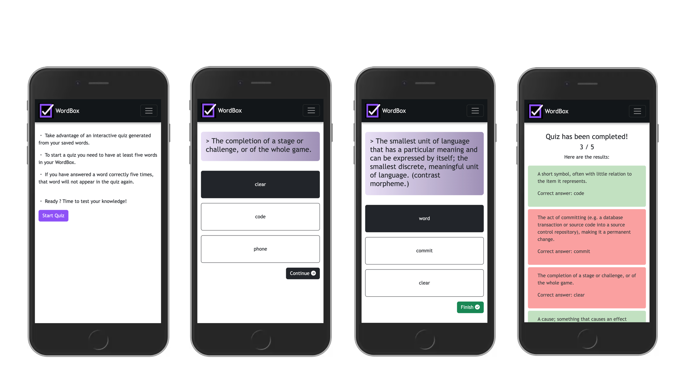
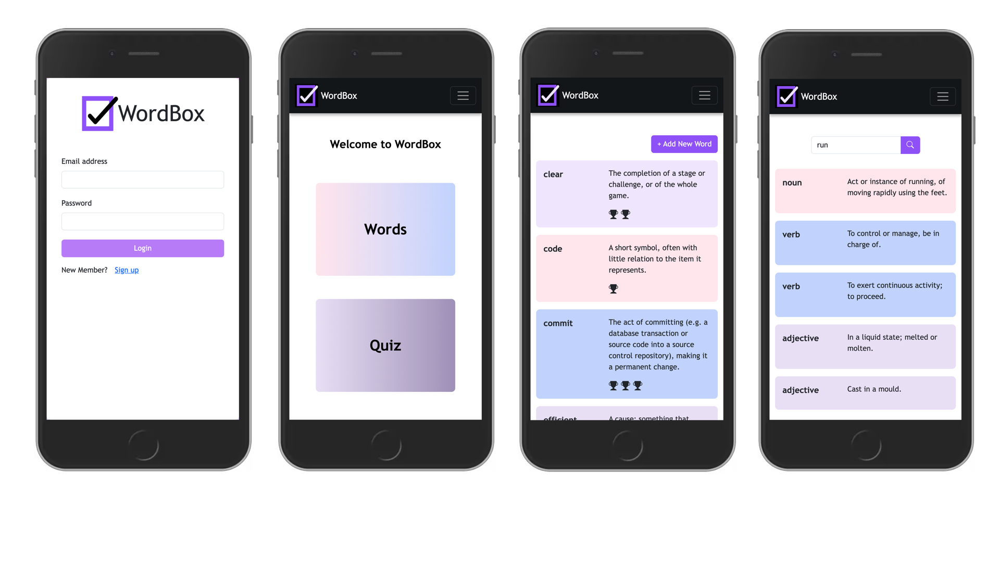

# WordBox

<p align="center">
  
</p>

WordBox is a word memorization app designed specifically for English language learners.

WordBox transforms the way users learn and retain vocabulary. With WordBox, users will be able to effortlessly save and organize their favorite words, building a personalized word bank for future reference. WordBox creates custom quizzes based on the saved words to challenge and reinforce users' memory. Each time users answer a word correctly in the quiz, they automatically receive a trophy.

The WordBox intelligently tracks users' progress, ensuring that once a word has been correctly identified at least five times, it is filtered out from future quizzes. This adaptive feature helps users focus on words that require further practice, maximizing the efficiency of their learning journey.

## Screenshots

<p align="center">
  
</p>
<p align="center">
  
</p>

## Getting started

1. Clone the repo
```
git clone https://github.com/seymagulas/wordbox.git
cd wordbox
```

2. Install dependencies for backend
```
cd server
npm i
```

3. Start development server for backend
```
npm run dev
```

4. Install dependencies for frontend
```
cd client
npm i
```

5. Start development server for frontend
```
npm start
```

## Tech stack

- [React](https://react.dev) - Frontend library for building user interfaces
- [TypeScript](https://www.typescriptlang.org) - Typed JavaScript extension for enchancing code quality
- [Bootstrap](https://getbootstrap.com) - Frontend framework for building responsive website with pre-designed components
- [Axios](https://axios-http.com/docs/intro) - Library for sending HTTP requests in JavaScript
- [Yup](https://github.com/jquense/yup) - JavaScript library for validating data against predefined rules
- [Font Awesome](https://fontawesome.com) - Customisable icon library

- [Express.js](https://expressjs.com) - Lightweight web framework for Node.js that makes building web applications
- [Sequelize](https://sequelize.org) - JavaScript library that makes working with databases easier by allowing you to use JavaScript code instead of complex database queries
- [Postgres](https://www.postgresql.org) - Powerful open-source database for storing and managing structured data

- [JWT](https://jwt.io) - App security with tokens

- [Dictionary API](https://dictionaryapi.dev) - API for getting the meanings of the words

## Generating the DB schema

You can run the following queries to create the DB in Postgres:

**DB structure:**
```sql
-- Database: word_box
-- DROP DATABASE IF EXISTS word_box;
CREATE DATABASE word_box
    WITH
    OWNER = root
    ENCODING = 'UTF8'
    LC_COLLATE = 'C'
    LC_CTYPE = 'C'
    TABLESPACE = pg_default
    CONNECTION LIMIT = -1
    IS_TEMPLATE = False;
```

**Users table:**
```sql
-- Table: public.Users
-- DROP TABLE IF EXISTS public."Users";
CREATE TABLE IF NOT EXISTS public."Users"
(
    id integer NOT NULL DEFAULT nextval('"Users_id_seq"'::regclass),
    name character varying(255) COLLATE pg_catalog."default" NOT NULL,
    email character varying(255) COLLATE pg_catalog."default" NOT NULL,
    password character varying(255) COLLATE pg_catalog."default" NOT NULL,
    "createdAt" timestamp with time zone NOT NULL,
    "updatedAt" timestamp with time zone NOT NULL,
    CONSTRAINT "Users_pkey" PRIMARY KEY (id)
)
TABLESPACE pg_default;
ALTER TABLE IF EXISTS public."Users"
    OWNER to root;
```

**Words table:**
```sql
-- Table: public.Words
-- DROP TABLE IF EXISTS public."Words";
CREATE TABLE IF NOT EXISTS public."Words"
(
    id integer NOT NULL DEFAULT nextval('"Words_id_seq"'::regclass),
    user_id integer NOT NULL,
    word character varying(255) COLLATE pg_catalog."default" NOT NULL,
    meaning text COLLATE pg_catalog."default" NOT NULL,
    correct_count integer NOT NULL DEFAULT 0,
    "createdAt" timestamp with time zone NOT NULL,
    "updatedAt" timestamp with time zone NOT NULL,
    CONSTRAINT "Words_pkey" PRIMARY KEY (id)
)
TABLESPACE pg_default;
ALTER TABLE IF EXISTS public."Words"
    OWNER to root;
```

**Quizzes table:**
```sql
-- Table: public.Quizzes

-- DROP TABLE IF EXISTS public."Quizzes";

CREATE TABLE IF NOT EXISTS public."Quizzes"
(
    id integer NOT NULL DEFAULT nextval('"Quizzes_id_seq"'::regclass),
    user_id integer NOT NULL,
    correct_count integer NOT NULL DEFAULT 0,
    wrong_count integer NOT NULL DEFAULT 0,
    "createdAt" timestamp with time zone NOT NULL,
    "updatedAt" timestamp with time zone NOT NULL,
    CONSTRAINT "Quizzes_pkey" PRIMARY KEY (id)
)

TABLESPACE pg_default;

ALTER TABLE IF EXISTS public."Quizzes"
    OWNER to root;
```

**Questions table:**
```sql
-- Table: public.Questions

-- DROP TABLE IF EXISTS public."Questions";

CREATE TABLE IF NOT EXISTS public."Questions"
(
    id integer NOT NULL DEFAULT nextval('"Questions_id_seq"'::regclass),
    quiz_id integer NOT NULL,
    user_id integer NOT NULL,
    answer character varying(255) COLLATE pg_catalog."default" NOT NULL,
    question text COLLATE pg_catalog."default" NOT NULL,
    is_correct boolean,
    "createdAt" timestamp with time zone NOT NULL,
    "updatedAt" timestamp with time zone NOT NULL,
    CONSTRAINT "Questions_pkey" PRIMARY KEY (id)
)

TABLESPACE pg_default;

ALTER TABLE IF EXISTS public."Questions"
    OWNER to root;
```

## Author

Seyma Gulas - [Github](https://github.com/seymagulas) - [LinkedIn](https://www.linkedin.com/in/seyma-gulas)

## License

This project is licensed under the MIT License.
